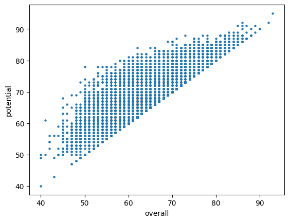

# FIFA Data Analysis

## 📌 Overview
This project analyzes FIFA player data to explore insights such as player performance, potential ratings, and distributions of various statistics.  
It uses **Python** with **Pandas**, **Matplotlib**, and **Seaborn** to perform data exploration and visualization.

## 🚀 Usage
1. Open the `fifa.ipynb` notebook in Jupyter Notebook or JupyterLab.
2. Run the cells sequentially to:
   - Load and clean the FIFA dataset.
   - Perform data analysis.
   - Generate visualizations for insights.

## 📊 Results
Below are some output images generated from the analysis:

### Player Overall Rating Distribution

### Top Players by Potential

---
💡 *Feel free to fork this repo and try your own analysis with the FIFA dataset!*